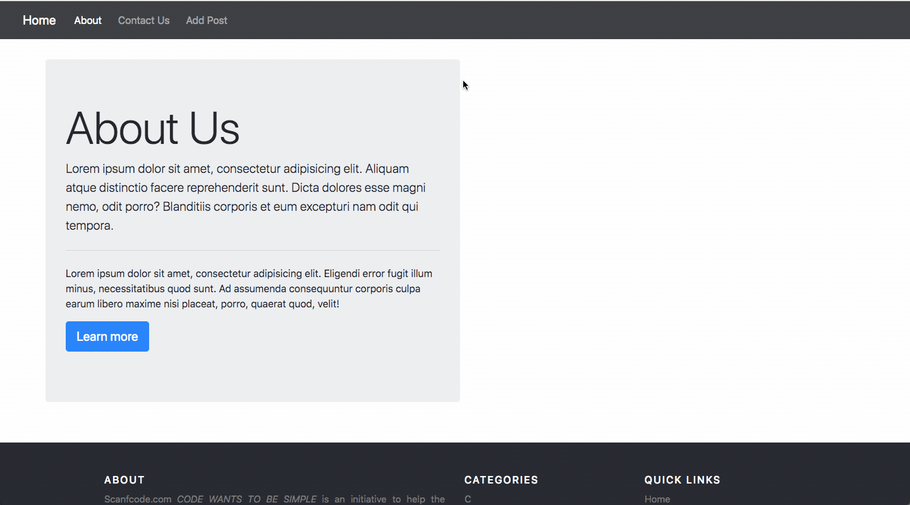
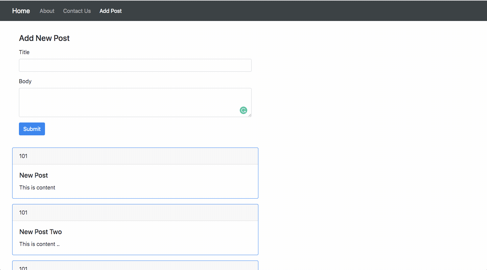

# React Workshop

:fire: This is a workshop for learning how to build React Applications.

## :video_camera: App Demo

## :video_camera: React Chrome Extension Demo

## Before you Start
I've branched the repo for individual topics.

To see all branches run: `git branch --all`.

To checkout to individual branch run: `git checkout <branch name>`. Then check its README.md .
 From there on you should be good.

## Branch Info

### Day 1:
1. :snowflake: [01-add-react-in-a-min](https://github.com/imranhsayed/react-workshop/tree/01-add-react-in-a-min) : Create a react app in a minute :clock1: using React Scripts
2. :rocket: [01-create-react-app](https://github.com/imranhsayed/react-workshop/tree/01-create-react-app) : Create a React application using create-react-app
3. :package: [01-react-app-parcel](https://github.com/imranhsayed/react-workshop/tree/01-react-app-parcel) : Create a React application using parcel
4. :gift: [01-react-app-webpack](https://github.com/imranhsayed/react-workshop/tree/01-react-app-webpack) :  Set up React application with using Webpack and Babel

### Day 2:
5. :tanabata_tree: [02-component-types](https://github.com/imranhsayed/react-workshop/tree/02-component-types) : Types of Components : Class & Functional Components
6. :dizzy: [02-jsx-examples](https://github.com/imranhsayed/react-workshop/tree/02-jsx-examples) : Examples of JSX
7. :snowman: [02-state-and-props](https://github.com/imranhsayed/react-workshop/tree/02-state-and-props) : Examples for Component State and Props
8. :ear_of_rice: [02-hierarchical-components](https://github.com/imranhsayed/react-workshop/tree/02-hierarchical-components) Demo for Parent & Child Component, with state and props.
9. :crossed_flags: [02-handling-routes](https://github.com/imranhsayed/react-workshop/tree/02-handling-routes) Handling routes using @reach/router
10. :ear_of_rice: [02-get-derived-state-from-props](https://github.com/imranhsayed/react-workshop/tree/02-get-derived-state-from-props) Example for Component Lifecycle method: getDerivedStateFromProps, constructor, forceUpdate

11. :clipboard: [02-handling-forms](https://github.com/imranhsayed/react-workshop/tree/02-handle-forms) Handling forms in react

### Day 3:
12. :package: [03-react-application-example](https://github.com/imranhsayed/react-workshop/tree/03-react-application-example) Example for creating React Application with Header Footer Navbar, Display Posts by fetching data from 
13. :snowman: [03-react-application-example2](https://github.com/imranhsayed/react-workshop/tree/03-react-application-example2) Example for Adding New posts using when the form is submitted.                                                                                                                        and api and Handling forms
                                                                                                                              
14. :evergreen_tree: [03-higher-order-component](https://github.com/imranhsayed/react-workshop/tree/03-higher-order-component) Higher Order Component Example 
15. :sweat_drops: [03-pure-component](https://github.com/imranhsayed/react-workshop/tree/03-pure-components) Pure Components Example
16. :memo: [03-react-memo](https://github.com/imranhsayed/react-workshop/tree/03-react-memo) React memo example
17. :arrow_right: [03-refs](https://github.com/imranhsayed/react-workshop/tree/03-refs) React's Refs example
18. :palm_tree: [03-context](https://github.com/imranhsayed/react-workshop/tree/03-context) React Context example

## Installation

1. Clone this repo in `git clone https://github.com/imranhsayed/react-workshop`

## Instructions

Please follow the README for individual repositories

## Common Commands

- `dev` Runs webpack dev server for development ( in watch mode )
- `prod` Runs webpack in production mode

